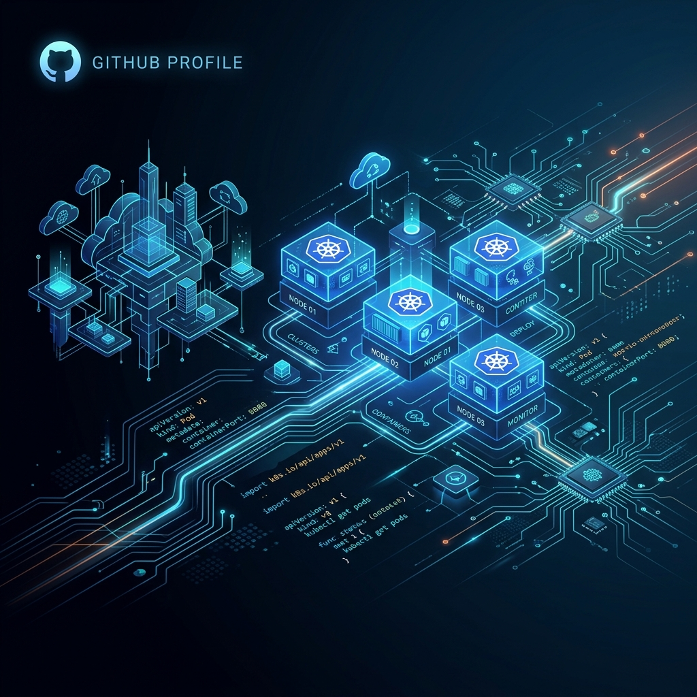

# 
👋 Hi, I'm Harshal Nikure

  

  <strong>Cloud Infrastructure & DevOps Engineer</strong> 
  Designing scalable, highly-available cloud platforms, automated GitOps pipelines, and robust infrastructure as code.

  
  

---

### 🚀 About Me

I am a specialized **Infrastructure & DevOps Engineer** focused on building production-ready platforms that bridge developer experience with operational excellence. I specialize in automations, cloud migrations, Kubernetes environments, and resilient infrastructure.

* 🛠️ **Currently Building:** Enterprise-grade GitOps patterns & Cloud migrations.
* 📦 **Core Focus:** Multi-cloud automation, container orchestration, and IaC pipelines.
* 💡 **AI in DevOps:** Exploring LLM integration for log analysis, automated code reviews, and smart monitoring.

---

### 🛠️ Tech Stack & Ecosystem

<table>
  <tr>
    <td valign="top" width="50%">
      <strong>☁️ Cloud & Platform</strong> 
      
      
      
      
    </td>
    <td valign="top" width="50%">
      <strong>⚙️ IaC & Configuration</strong> 
      
      
      
    </td>
  </tr>
  <tr>
    <td valign="top" width="50%">
      <strong>🔄 CI/CD & GitOps</strong> 
      
      
      
    </td>
    <td valign="top" width="50%">
      <strong>💻 Languages & Scripting</strong> 
      
      
      
      
    </td>
  </tr>
  <tr>
    <td valign="top" width="50%">
      <strong>📊 Observability & Tooling</strong> 
      
      
      
    </td>
    <td valign="top" width="50%">
      <strong>🛡️ Quality & Ops</strong> 
      
      
    </td>
  </tr>
</table>

---

### 💡 Featured Projects

* 🛠️ **[universal_terraform_infra_deployment](https://github.com/icharshal/universal_terraform_infra_deployment)** — Universal declarative Multi-Cloud deployment suite. Fully modularized Terraform blueprints for AWS/GCP infrastructures.
* 📦 **[gcs-drive-migration-toolkit](https://github.com/icharshal/gcs-drive-migration-toolkit)** — An enterprise migration tool built to transfer up to 12TB of unstructured data seamlessly from Google Drive into Google Cloud Storage (GCS).
* ⚙️ **[Code_Quality_Analyzer](https://github.com/icharshal/Code_Quality_Analyzer)** — Fully automated Python pipeline verifying static analysis, code smells, syntax correctness, and security vulnerabilities prior to deployment.
* 🤖 **[ai-messaging-assistant](https://github.com/icharshal/ai-messaging-assistant)** — AI-driven background assistant for modern messaging platforms, enabling LLM-guided context extraction and notification handling.

---

### 📊 GitHub Activity & Stats

  
  

---

  "Infrastructure as Code is not just a tool, it's a software engineering philosophy."

